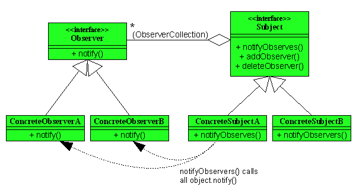

# 观察者模式(Observer Pattern)
## 简介
***观察者模式（有时又被称为发布/订阅模式）是软件设计模式的一种。在此种模式中，一个目标对象管理所有相依于它的观察者对象，并且在它本身的状态改变时主动发出通知。这通常透过呼叫各观察者所提供的方法来实现。此种模式通常被用来实时事件处理系统。***



### 抽象目标类别
此抽象类别提供一个界面让观察者进行添附与解附作业。此类别内有个不公开的观察者串炼，并透过下列函式(方法)进行作业

* 添附(Attach)：新增观察者到串炼内，以追踪目标对象的变化。
* 解附(Detach)：将已经存在的观察者从串炼中移除。
* 通知(Notify)：利用观察者所提供的更新函式来通知此目标已经产生变化。

添附函式包涵了一个观察者对象参数。也许是观察者类别的虚拟函式(即更新函式)，或是在非面向对象的设定中所使用的函式指标(更广泛来讲，函式子或是函式对象)。

### 目标类别
此类别提供了观察者欲追踪的状态。也利用其源类别(例如前述的抽象目标类别)所提供的方法,来通知所有的观察者其状态已经更新。此类别拥有以下函式

* 取得状态(GetState)：回传该目标对象的状态。

### 抽象观察者界面
抽象观察者类别是一个必须被实做的抽象类别。这个类别定义了所有观察者都拥有的更新用界面，此界面是用来接收目标类别所发出的更新通知。此类别含有以下函式

* 更新(Update)：会被实做的一个抽象(虚拟)函式。

### 观察者类别 
这个类别含有指向目标类别的参考(reference)，以接收来自目标类别的更新状态。此类别含有以下函式

* 更新(Update)：是前述抽象函式的实做。当这个函式被目标对象呼叫时，观察者对象将会呼叫目标对象的取得状态函式，来其所拥有的更新目标对象资讯。
每个观察者类别都要实做它自己的更新函式，以应对状态更新的情形。

当目标对象改变时，会通过呼叫它自己的通知函式来将通知送给每一个观察者对象，这个通知函式则会去呼叫已经添附在串炼内的观察者更新函式。通知与更新函式可能会有一些参数，好指明是目前目标对象内的何种改变。这么作将可增进观察者的效率(只更新那些改变部分的状态)。

### 用途

* 当抽象个体有两个互相依赖的层面时。封装这些层面在单独的对象内将可允许程序员单独地去变更与重复使用这些对象，而不会产生两者之间交互的问题。
* 当其中一个对象的变更会影响其他对象，却又不知道多少对象必须被同时变更时。
* 当对象应该有能力通知其他对象，又不应该知道其他对象的实做细节时。

```
=== C++ ===
<source lang="cpp">
#include <list>
#include <vector>
#include <algorithm>
#include <iostream>
using namespace std;

// The Abstract Observer
class ObserverBoardInterface
{
public:
    virtual void update(float a,float b,float c) = 0;
};

// Abstract Interface for Displays
class DisplayBoardInterface
{
public:
    virtual void show() = 0;
};

// The Abstract Subject
class WeatherDataInterface
{
public:
    virtual void registerob(ObserverBoardInterface* ob) = 0;
    virtual void removeob(ObserverBoardInterface* ob) = 0;
    virtual void notifyOb() = 0;
};

// The Concrete Subject
class ParaWeatherData: public WeatherDataInterface
{
public:
    void SensorDataChange(float a,float b,float c)
    {
        m_humidity = a;
        m_temperature = b;
        m_pressure = c;
        notifyOb();
    }

    void registerob(ObserverBoardInterface* ob)
    {
        m_obs.push_back(ob);
    }

    void removeob(ObserverBoardInterface* ob)
    {
        m_obs.remove(ob);
    }
protected:
    void notifyOb()
    {
        list<ObserverBoardInterface*>::iterator pos = m_obs.begin();
        while (pos != m_obs.end())
        {
            ((ObserverBoardInterface* )(*pos))->update(m_humidity,m_temperature,m_pressure);
            (dynamic_cast<DisplayBoardInterface*>(*pos))->show();
            ++pos;
        }
    }

private:
    float        m_humidity;
    float        m_temperature;
    float        m_pressure;
    list<ObserverBoardInterface* > m_obs;
};

// A Concrete Observer
class CurrentConditionBoard : public ObserverBoardInterface, public DisplayBoardInterface
{
public:
    CurrentConditionBoard(WeatherDataInterface& a):m_data(a)
    {
        m_data.registerob(this);
    }
    void show()
    {
        cout<<"_____CurrentConditionBoard_____"<<endl;
        cout<<"humidity: "<<m_h<<endl;
        cout<<"temperature: "<<m_t<<endl;
        cout<<"pressure: "<<m_p<<endl;
        cout<<"_______________________________"<<endl;
    }

    void update(float h, float t, float p)
    {
        m_h = h;
        m_t = t;
        m_p = p;
    }

private:
    float m_h;
    float m_t;
    float m_p;
    WeatherDataInterface& m_data;
};

// A Concrete Observer
class StatisticBoard : public ObserverBoardInterface, public DisplayBoardInterface
{
public:
    StatisticBoard(WeatherDataInterface& a):m_maxt(-1000),m_mint(1000),m_avet(0),m_count(0),m_data(a)
    {
        m_data.registerob(this);
    }

    void show()
    {
        cout<<"________StatisticBoard_________"<<endl;
        cout<<"lowest  temperature: "<<m_mint<<endl;
        cout<<"highest temperature: "<<m_maxt<<endl;
        cout<<"average temperature: "<<m_avet<<endl;
        cout<<"_______________________________"<<endl;
    }

    void update(float h, float t, float p)
    {
        ++m_count;
        if (t>m_maxt)
        {
            m_maxt = t;
        }
        if (t<m_mint)
        {
            m_mint = t;
        }
        m_avet = (m_avet * (m_count-1) + t)/m_count;
    }

private:
    float m_maxt;
    float  m_mint;
    float m_avet;
    int m_count;
    WeatherDataInterface& m_data;
};


int main(int argc, char *argv[])
{
   
    ParaWeatherData * wdata = new ParaWeatherData;
    CurrentConditionBoard* currentB = new CurrentConditionBoard(*wdata);
    StatisticBoard* statisticB = new StatisticBoard(*wdata);

    wdata->SensorDataChange(10.2, 28.2, 1001);
    wdata->SensorDataChange(12, 30.12, 1003);
    wdata->SensorDataChange(10.2, 26, 806);
    wdata->SensorDataChange(10.3, 35.9, 900);

    wdata->removeob(currentB);

    wdata->SensorDataChange(100, 40, 1900);  
    
    delete statisticB;
    delete currentB;
    delete wdata;

    return 0;
}

```

将一个系统分割成一系列相互作用的类有个很不好的副作用，那就是需要维护相关对象间的一致性。我们不希望为了维持一致性而逝各类紧密耦合，这样会给维护，扩展和重用都带来不便。

什么时候考虑使用观察者模式呢。

***当一个对象的改变需要同事改变其它对象而且它不知道具体有多少对象有待改变时应该考虑使用观察者模式。***

一个抽象模型有两个方面，其中一方面依赖于另一方面，这时用观察者模式可以将这两者防撞在独立的对象中使它们各自独立地改变和服用。

***总的来讲，观察者模式所做的工作其实就是在解除耦合，让耦合的双方都依赖于抽象，而不是依赖于具体。从而使得各自的变化都不会影响另一个的变化。***