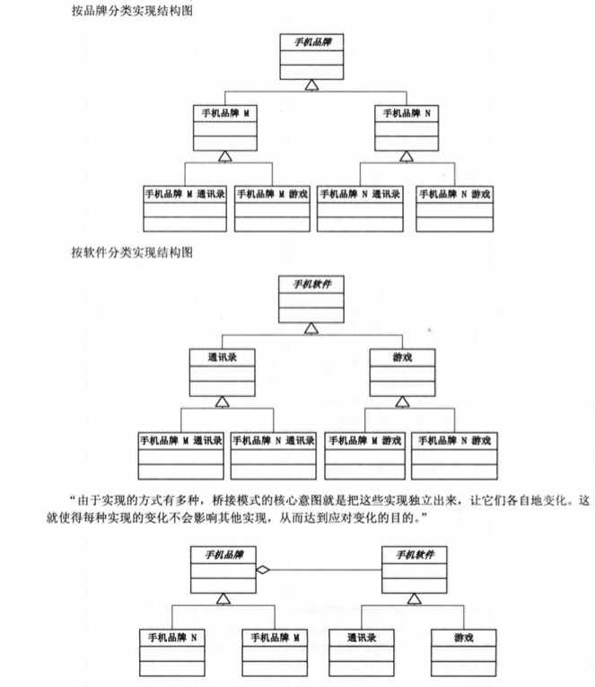

# 桥接模式(Bridge Pattern)

## 简介
桥接模式把事物对象和其具体行为、具体特征分离开来，使它们可以各自独立的变化。事物对象仅是一个抽象的概念。如“圆形”、“三角形”归于抽象的“形状”之下，而“画圆”、“画三角”归于实现行为的“画图”类之下，然后由“形状”调用“画图”。

如果有一个N品牌的手机，它有个小游戏，我要玩游戏，程序应该如何写？

```
//N品牌的手机中的游戏
class HandSetNGame
{
	public void Run()
	{
		Console.WriteLine("运行N品牌");
	}
}

```

客户端

```
HandSetNGame game = new HandSetGame();
game.run();
```
现在又有一个M品牌的手机，也是小游戏，客户端也可以调用，如何做？

```
class HandSetGame
{
	public virtual void Run()
	{
	}
}
```

M品牌手机游戏和N品牌手机游戏

```
class HandSetMGame : HandSetGanme
{
	public override void Run()
	{
		Console.WriteLine("运行M品牌手机游戏");
	}
}

class HandSetNGame : HandSetGanme
{
	public override void Run()
	{
		Console.WriteLine("运行N品牌手机游戏");
	}
}

```

然后，由于手机都需要通讯录功能，于是N品牌和M品牌都增加了通讯录的增删该查功能，如何处理？


```
//手机品牌
class HandSetBrand
{
	public virtual void run()
	{
	}
}
```

```
//手机品牌M
class HandSetBrandM:HandsetBrand
{
}

//手机品牌N
class HandSetBrandM:HandsetBrand
{
}

```

下属的各自通讯录类和游戏类

```
//手机品牌M的游戏
class HandSetBrandMGame:HandSetBrandM
{
	public override void Run()
	{
		Console.WriteLine("运行M品牌手机游戏");
	}
}

//手机品牌N的游戏
class HandSetBrandMGame:HandSetBrandM
{
	public override void Run()
	{
		Console.WriteLine("运行N品牌手机游戏");
	}
}

//手机品牌M的通讯录
class HandSetBrandMAddressList:HandSetBrandM
{
	public override void Run()
	{
		Console.WriteLine("运行M品牌手机通讯录");
	}
}

//手机品牌N的
class HandSetBrandMAddressList:HandSetBrandM
{
	public override void Run()
	{
		Console.WriteLine("运行N品牌手机通讯录");
	}
}

```

客户端调用代码

```
static void Main(strring[] args)
{
	HandSetBrand ab;
	
	ab = new HandSetBrandMAddressList();
	ab.Run();
	
	ab = new HandSetBrandNAddressList();
	ab.Run();
	
	ab = new HandSetBrandMGame();
	ab.Run();
	
	ab = new HandSetBrandNGame();
	ab.Run();
	
	Console.Read();
}
```

如果我现在需要每个品牌都增加一个MP3音乐功能，如何做？还增加子类？

***对象的继承关系是在编译时就定义好的，所以无法在运行时改变从父类继承的实现，子类的实现与它的父类有非常紧密的依赖关系，以至于父类实现中的任何变化必然会导致子类发生变化。当你需要复用子类时，如果继承下来的实现不适合解决新的问题，则父类必须重写或被其它更适合的类替换。这种依赖关系限制了灵活性并最终限制了复用性。***

***

***合成(Composition)／聚合(Aggregation)复用原则,尽量使用合成／聚合，尽量不要使用类继承。***

***

聚合表示一种弱的'拥有'关系，体现的是A对象可以包含B对象，但是B对象不是A对象的一部分。合成则是一种强的'拥有'关系，体现了严格的部分和整体的关系，部分和整体的生命周期一样。

比如说 大雁有翅膀，大雁和翅膀是部分和整体的关系，并且它们生命周期是一样的，于是它们就是合成关系。而大雁是群居动物，所以每只大雁都属于一个雁群，一个雁群可以有很多大雁，所以大雁和雁群是聚合关系。

***优先使用对象的合成／聚合将有助于你保持每个类被封装，并被集中在单个任务上。这样类和类继承层次会保持较小规模，并且不太可能增长为不可控制的庞然大物。***

像'游戏'，'通讯录'，'MP3音乐'，如果我们可以让其分离与手机的耦合，那么可以大大减少面对新需求改动过大的不合理情况。

松耦合的程序

```
//手机软件
abstract class HandsetSoft
{
	public abstract void Run();
}
```

游戏，通讯录等具体类
```
//手机游戏
class HandsetGame : HandSetSoft
{
	public override void Run()
	{
		Console.WriteLine("运行手机游戏");
	}
}

//手机通讯录
class HandsetAddressList : HandSetSoft
{
	public override void Run()
	{
		Console.WriteLine("运行手机通讯录");
	}
}
```

```
//手机品牌
abstract class HandsetBrand
{
	protected HandsetSoft soft;
	
	//设置手机软件
	public void SetHandSetSoft(HandSetSoft soft)
	{
		this.soft = soft;
	}
	//运行
	public abtract void run();
}
```

品牌N品牌M具体类

```
//手机品牌N
class HandSetBrandN: HandBrand
{
	public override void Run()
	{
		soft.Run();
	}
}

//手机品牌M
class HandSetBrandM: HandBrand
{
	public override void Run()
	{
		soft.Run();
	}
}

```

客户端代码

```
static void Mian(string[] args)
{
	HandSetBrand ab;
	ab = new HandSetBrandN();
	
	ab.setHandSetSoft(new HandSetGame());
	ab.run();
	
	ab.setHandSetSoft(new HandSetAddressList());
	ab.run();
	
	ab = new HandSetBrandM();
	
	ab.setHandSetSoft(new HandSetGame());
	ab.run();
	
	ab.setHandSetSoft(new HandSetAddressList());
	ab.run();
	
	Console.Read();
}
```

现在我们要再加个功能 比如说MP3功能，只要增加这个类就好了，不会影响其它任何类。

```
//手机MP3播放
class HandsetMP3 : HandSetSoft
{
	public override void Run()
	{
		Console.WriteLine("运行手机MP3");
	}
}
```

如果要增加S品牌，只需要增加一个品牌子类就可以了。

```
//手机品牌S
class HandSetBrand: HandSetBrand
{
	public override void Run()
	{
		soft.Run();
	}
}
```

### 桥接模式

桥接模式:将抽象部分与它的实现部分分离，使它们都可以独立地变化。

什么叫抽象与它的实现分离，这并不是说，让抽象与其派生类分离，因为这没有任何意义。实现指的是抽象类和它的派生类用来实现自己的对象。




桥接模式基本代码


 桥接模式把两个角色之间的继承关系改为聚合关系，从而使二者可以各自独立的变化。把原来在基类的实现化细节抽象出来，再构造到一个实现化的结构中，然后把原来的基类改造成一个抽象化的等级结构，这样就实现了系统在多个维度上的独立变化。
