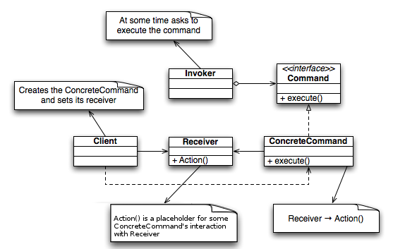

# 命令模式(Command Pattern)

## 简介
在面向对象程式设计的范畴中，命令模式是一种设计模式，它尝试以物件来代表实际行动。命令物件可以把行动(action) 及其参数封装起来，于是这些行动可以被：

* 重复多次
* 取消（如果该物件有实作的话）
* 取消后又再重做

这些都是现代大型应用程序所必须的功能，即“复原”及“重复”。除此之外，可以用命令模式来实作的功能例子还有：

* 交易行为
* 进度列
* 精灵
* 使用者界面按钮及功能表项目
* 执行绪 pool
* 宏收录



JavaScript

```
/* The Invoker function */
var Switch = function(){
    var _commands = [];
    this.storeAndExecute = function(command){
        _commands.push(command);
        command.execute();
    }
}

/* The Receiver function */
var Light = function(){
    this.turnOn = function(){ console.log ('turn on')};
    this.turnOff = function(){ console.log ('turn off') };
}

/* The Command for turning on the light - ConcreteCommand #1 */
var FlipUpCommand = function(light){
    this.execute = light.turnOn;
}

/* The Command for turning off the light - ConcreteCommand #2 */
var FlipDownCommand = function(light){
    this.execute = light.turnOff;
}

var light = new Light();
var switchUp = new FlipUpCommand(light);
var switchDown = new FlipDownCommand(light);
var s = new Switch();

s.storeAndExecute(switchUp);
s.storeAndExecute(switchDown);
```

Java

```
import java.util.List;
import java.util.ArrayList;

/* The Command interface */
public interface Command {
   void execute();
}

/* The Invoker class */
public class Switch {
   private List<Command> history = new ArrayList<Command>();

   public Switch() {
   }

   public void storeAndExecute(Command cmd) {
      this.history.add(cmd); // optional 
      cmd.execute();        
   }
}

/* The Receiver class */
public class Light {
   public Light() {
   }

   public void turnOn() {
      System.out.println("The light is on");
   }

   public void turnOff() {
      System.out.println("The light is off");
   }
}

/* The Command for turning on the light - ConcreteCommand #1 */
public class FlipUpCommand implements Command {
   private Light theLight;

   public FlipUpCommand(Light light) {
      this.theLight = light;
   }

   public void execute(){
      theLight.turnOn();
   }
}

/* The Command for turning off the light - ConcreteCommand #2 */
public class FlipDownCommand implements Command {
   private Light theLight;

   public FlipDownCommand(Light light) {
      this.theLight = light;
   }

   public void execute() {
      theLight.turnOff();
   }
}

/* The test class or client */
public class PressSwitch {
   public static void main(String[] args){
      Light lamp = new Light();
      Command switchUp = new FlipUpCommand(lamp);
      Command switchDown = new FlipDownCommand(lamp);

      Switch mySwitch = new Switch();

      try {
         if ("ON".equalsIgnoreCase(args[0])) {
            mySwitch.storeAndExecute(switchUp);
         }
         else if ("OFF".equalsIgnoreCase(args[0])) {
            mySwitch.storeAndExecute(switchDown);
         }
         else {
            System.out.println("Argument \"ON\" or \"OFF\" is required.");
         }
      } catch (Exception e) {
         System.out.println("Arguments required.");
      }
   }
}
```

## 实例
### 模拟烧烤

#### 紧耦合设计

```
//烤肉串者
public class Barbecuer
{
	//烤羊肉
	public void BakeMutton()
	{
		Console.WriteMutton("烤羊肉串");
	}
	//烤鸡翅
	public void BakeChikenWing()
	{
		Console.WriteMutton("烤鸡翅");
	}
	
}
```

客户端调用

```
static void Main(string[] args)
{
	Barbecuer boy = new Barbecuew();
	boy.BakeMutton();
	boy.BakeMutton();
	boy.BakeMutton();
	boy.BakeChickenWing();
}
```

#### 松耦合设计

抽象命令类

```
//抽象命令
public abstract class Command
{
	protected Barbecuer receiver;
	
	public Command(Barbecuer receiver)
	{
		this.receiver = receiver;
	}
	
	//执行命令
	abstract public ExcuteCommand();
}
```

具体命令类

```
//烤羊肉命令
class BakeMuttonCommand: Command
{
	public BakeMuttonCommand(Barbecuer receiver)
	{
		:base(receiver)
	}
	
	public override void EccuteCommand()
	{
		receiver.BakeMutton();
	}
}

//烤鸡翅命令
class BakeMuttonCommand: Command
{
	public BakeMuttonCommand(Barbecuer receiver)
	{
		:base(receiver)
	}
	
	public override void EccuteCommand()
	{
		receiver.BakeChickenWing();
	}
}

```

服务员类

```
//服务员
public class Waiter
{
	private Command command;
	
	//设置订单
	public void setOrder(Command command)
	{
		this.command
	}
	
	//通知执行
	public void Notify()
	{
		command.ExcuteCommand();
	}
}
```

```
//烤肉串者
public class Barbecuer
{
	//烤羊肉
	public void BakeMutton()
	{
		Console.WriteMutton("烤羊肉串");
	}
	//烤鸡翅
	public void BakeChikenWing()
	{
		Console.WriteMutton("烤鸡翅");
	}
	
}
```

客户端实现

```
static void Main(string[] args)
{
	//开店前的准备
	Barbecuer boy = new Barbecuer();
	Command BakeMuttonCommand1 = new BakeMuttonCommand(boy);
	Command BakeMuttonCommand2 = new BakeMuttonCommand(boy);
	Command BakeChickenWingCommand1 = new BakeMuttonCommand(boy);
	
	Waiter girl = new Waiter();
	
	//开门营业
	girl.SetOrder(BakeMuttonCommand1);
	girl.Notify();

	girl.SetOrder(BakeMuttonCommand2);
	girl.Notify();	
	
	girl.SetOrder(BakeChickenWingCommand1);
	girl.Notify();	
		
	COnsole.Read();
}

```

#### 松耦合后

```
//服务员
public class Waiter
{
	private IList<Command> orders = new List<Command>();
	
	//设置订单
	public void SetOrder(Command command)
	{
		if (command.ToString() == "命令模式.BakeChikenWingCommand")
		{
			Console.WriteLine("服务员：鸡翅没有了，请点别的烧烤。");
		} 
		else
		{
			orders.Add(command);
			Console.WriteLine("增加订单："+ command.ToString() + "时间" + DateTime.Now.ToString());
		}
	}
	
	//取消订单
	public void CancelOrder(Command command)
	{
		orders.Remove(command);
		Console.WriteLine("取消订单" + command.ToString() + "时间" + DateTime.Now.ToString());
	}
	
	//通知全部执行
	public void Notify()
	{
		foreach(Command cmd in orders)
		{
			cmd.ExcuteCommand();
		}
	}
}
```

客户端代码实现

```
static void Main(string[] args)
{
	
	Barbecuer boy = new Barbecuer();
	Command BakeMuttonCommand1 = new BakeMuttonCommand(boy);
	Command BakeMuttonCommand2 = new BakeMuttonCommand(boy);
	Command BakeChickenWingCommand1 = new BakeMuttonCommand(boy);
	
	Waiter girl = new Waiter();
	
	girl.setOrder(bakeMuttonCommand1);
	girl.setOrder(bakeMuttonCommand1);
	girl.setOrder(BakeChickenWingCommand1);
	
	girl.Notify();
	
	Console.Read();
}
```

***命令模式:将一个请求封装为一个对象，从而使你可用不同的请求对客户进行参数话；对请求排队或者纪录请求日志，以及支持可撤销的操作。***

命令模式的优点:

* 容易地设计一个命令队列。
* 在需求的情况下，比较容易地将命令记入日志。
* 允许接受请求的一方决定是否要回绝请求。
* 很容易对请求撤销或者重做。
* 加入新的命令类不影响其它的类。
* 把请求一个操作的对象与知道怎么执行一个操作的对象分割开。

