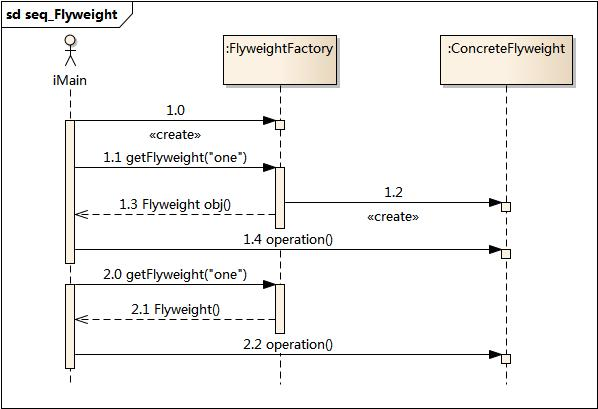
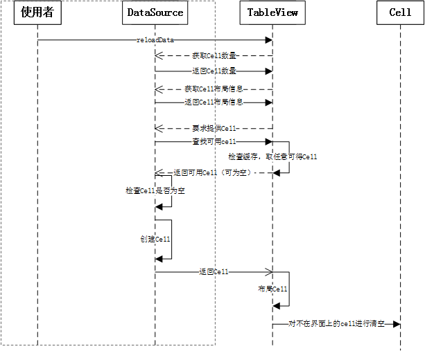

# 享元模式(Flyweight Pattern)

## 简介
享元模式（英语：Flyweight Pattern）是一种软件设计模式。它使用共享物件，用来尽可能减少内存使用量以及分享资讯给尽可能多的相似物件；它适合用于当大量物件只是重复因而导致无法令人接受的使用大量内存。通常物件中的部分状态是可以分享。常见做法是把它们放在外部数据结构，当需要使用时再将它们传递给享元。


典型的享元模式的例子为文书处理器中以图形结构来表示字符。一个做法是，每个字形有其字型外观, 字模 metrics, 和其它格式资讯，但这会使每个字符就耗用上千字节。取而代之的是，每个字符参照到一个共享字形物件，此物件会被其它有共同特质的字符所分享；只有每个字符（文件中或页面中）的位置才需要另外储存。

示例

```
public enum FontEffect {
    BOLD, ITALIC, SUPERSCRIPT, SUBSCRIPT, STRIKETHROUGH
}

public final class FontData {
    /**
     * A weak hash map will drop unused references to FontData.
     * Values have to be wrapped in WeakReferences, 
     * because value objects in weak hash map are held by strong references.
     */
    private static final WeakHashMap<FontData, WeakReference<FontData>> FLY_WEIGHT_DATA =
        new WeakHashMap<FontData, WeakReference<FontData>>();
    private final int pointSize;
    private final String fontFace;
    private final Color color;
    private final Set<FontEffect> effects;

    private FontData(int pointSize, String fontFace, Color color, EnumSet<FontEffect> effects) {
        this.pointSize = pointSize;
        this.fontFace = fontFace;
        this.color = color;
        this.effects = Collections.unmodifiableSet(effects);
    }

    public static FontData create(int pointSize, String fontFace, Color color,
        FontEffect... effects) {
        EnumSet<FontEffect> effectsSet = EnumSet.noneOf(FontEffect.class);
        for (FontEffect fontEffect : effects) {
            effectsSet.add(fontEffect);
        }
        // We are unconcerned with object creation cost, we are reducing overall memory consumption
        FontData data = new FontData(pointSize, fontFace, color, effectsSet);

        // Retrieve previously created instance with the given values if it (still) exists
        WeakReference<FontData> ref = FLY_WEIGHT_DATA.get(data);
        FontData result = (ref != null) ? ref.get() : null;
        
        // Store new font data instance if no matching instance exists
        if (result == null) {
            FLY_WEIGHT_DATA.put(data, new WeakReference<FontData> (data));
            result = data;
        }
        // return the single immutable copy with the given values
        return result;
    }

    @Override
    public boolean equals(Object obj) {
        if (obj instanceof FontData) {
            if (obj == this) {
                return true;
            }
            FontData other = (FontData) obj;
            return other.pointSize == pointSize && other.fontFace.equals(fontFace)
                && other.color.equals(color) && other.effects.equals(effects);
        }
        return false;
    }

    @Override
    public int hashCode() {
        return (pointSize * 37 + effects.hashCode() * 13) * fontFace.hashCode();
    }

    // Getters for the font data, but no setters. FontData is immutable.
}
```

结构图


时序图



## 实例

### 第一版

```
//网站
class WebSite
{
	private string name = "";
	private WebSite(string name)
	{
		this.name = name;
	}
	public void Use()
	{
		Console.WriteLine("网站分类" + name);
	}
}
```

客户端代码

```
static void Main(string args)
{
	WebSite fx = new WebSite("产品展示");
	fx.Use();
	
	WebSite fy = new WebSite("产品展示");
	fy.Use();
	
	WebSite f1 = new WebSite("博客");
	f1.Use();	
	
	WebSite f2 = new WebSite("博客");
	f2.Use();	
	
	Console.Read();
}
```

### 第二版

网站抽象类
```
abstract class WebSite
{
	public abstract void Use();
}
```

具体网站类 

```
class ConcreteWebSite :WebSite
{
	private string name = "";
	public ConcreteWebSite(string name)
	{
		this.name =name;
	}
	public override void Use()
	{
		Console.WriteLine("网站分类:" + name);
	}
}
```

网站工厂类

```
//网站工厂
class WebSiteFactory
{
	private HashTable flyweights = new Hashtable();
	
	//获得网站分类
	public WebSite GetWebSiteCategory(string key)
	{
		if (!flyweight.ContainKey(key))
		flyweights.Add(key, new ConcreteWebSite(key));
		return ((WebSite)flyweights[key]);
	}
	//获得网站分类总数
	public int GetWebSiteCount()
	{
		return flyweights.Count;
	}
}
```
客户端代码

```
static void Main(string[] args)
{	
	WebSiteFactory f = new WebSiteFactory();
	
	WebSite fx = f.GetWebSiteCategory("产品展示");
	fx.Use();
	
	WebSite fy = f.GetWebSiteCategory("产品展示");
	fy.Use();
		
	WebSite f1 = f.GetWebSiteCategory("博客");
	f1.Use();
	
	WebSite f2 = f.GetWebSiteCategory("博客");
	f2.Use();
	
}
```

***实际上，享元模式可以避免大量非常详细类的开销。在程序设计中，有时需要生成大量细力度的类实例来表示数据。如果能发现这些实例除了几个参数外基本上都是相同的，有时就能够受大幅度地减少需要实例化的类的数量。如果能把这些蚕食移到类实例的外面，在方法调用时将它们传递进来，就可以通过共享大幅度地减少单个实例的数目。***

### 第三版

用户类，用于网站的客户端账号，是"网站"类的外部状态

```
//用户
public class User
{
	private string name;
	public User(string name)
	{
		this.name = name;
	}
	public string name
	{
		get {return name;}
	}
}
```
网站抽象类


```
abstract class WebSite
{
	public abstract void Use(User user);
}
```

具体网站类

```
class ConcreteWebSite: WebSite
{
	private string name = "";
	public ConcreteWebSite(string name)
	{
		this.name = name;
	}
	
	public override void Use(Use user)
	{
		Console.WriteLine("网站分类:" ＋ name + "用户:" + user.name);
	}
}
```

网站工厂类

```
class WebSiteFactory
{
	private Hashtable flyweights = new HashTable();
	
	//获得网站分类
	public WebSite GetWebSiteCateegory(string key)
	{
		if (!flyweights.ContainsKey(key))
		flyweights.Add(key, new ConcreteWebSite(key));
		return ((webSite)flyweightskey[key]);
	}
	
	//获得网站分类总数
	public int GetWebSiteCount
	{
		return flyweights.Count;
	}
}
```

客户端代码

```
static void Main(string[] args)
{	
	WebSiteFactory f = new WebSiteFactory();
	
	WebSite fx = f.GetWebSiteCategory("产品展示");
	fx.Use(new User("小菜"));
	
	WebSite fy = f.GetWebSiteCategory("产品展示");
	fy.Use(new User("小白"));
		
	WebSite f1 = f.GetWebSiteCategory("博客");
	f1.Use(new User("小黑"));
	
	WebSite f2 = f.GetWebSiteCategory("博客");
	f2.Use(new User("小绿"));
	
	Console.Read();
}

```

***如果一个应用程序使用了大量的对象，而大量哒这些对象造成了很大的储存开销时就应该考虑使用；还有就是对象的大多数状态可以外部状态，如果删除对象的外部状态，那么可以用相对较少的共享对象取代很多组对象，此时可以考虑使用享元模式。***


## 经典案例 

### Cell的重用


在使用UITableView的时候我们应该熟悉这样的接口：

```
- (id)dequeueReusableCellWithIdentifier:(NSString *)identifier

//ios6
- (id)dequeueReusableCellWithIdentifier:(NSString *)identifier forIndexPath:(NSIndexPath *)indexPath
```

在要使用一个Cell的时候我们先去看看tableView中有没有可以重用的cell，如果有就用这个可以重用的cell，只有在没有的时候才去创建一个Cell。这就是享元模式。

享元模式可以理解成，当细粒度的对象数量特别多的时候运行的代价会相当大，此时运用共享的技术来大大降低运行成本。比较突出的表现就是内容有效的抑制内存抖动的情况发生，还有控制内存增长。它的英文名字是flyweight，让重量飞起来。哈哈。名副其实，在一个TableView中Cell是一个可重复使用的元素，而且往往需要布局的cell数量很大。如果每次使用都创建一个Cell对象，系统的内容抖动会非常明显，而且系统的内存消耗也是比较大的。突然一想，享元模式只是给对象实例共享提供了一个比较霸道的名字吧。

```
- (DZTableViewCell*) dzTableView:(DZTableView *)tableView cellAtRow:(NSInteger)row
{
    static NSString* const cellIdentifiy = @"detifail";
    DZTypeCell* cell = (DZTypeCell*)[tableView dequeueDZTalbeViewCellForIdentifiy:cellIdentifiy];
    if (!cell) {
        cell = [[DZTypeCell alloc] initWithIdentifiy:cellIdentifiy];
    }
    NSString* text = _timeTypes[row];
    return cell;
}
```


