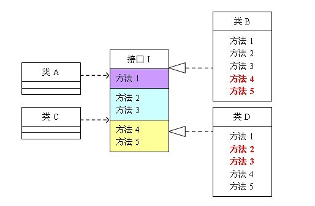
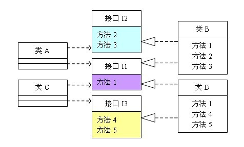

# 接口隔离原则(Interface Segregation Principle)

## 简介
接口隔离原则（英语：interface-segregation principles， 缩写：ISP）指明没有客户(client)应该被迫依赖于它不使用方法。接口隔离原则(ISP)拆分非常庞大臃肿的接口成为更小的和更具体的接口，这样客户将会只需要知道他们感兴趣的方法。这种缩小的接口也被称为角色接口（role interfaces）。接口隔离原则(ISP)的目的是系统解开耦合，从而容易重构，更改和重新部署。接口隔离原则是在SOLID (面向对象设计)中五个面向对象设计(OOD)的原则之一，类似于在GRASP (面向对象设计)中的高内聚性。


## 实例
定义：客户端不应该依赖它不需要的接口；一个类对另一个类的依赖应该建立在最小的接口上。
问题由来：类A通过接口I依赖类B，类C通过接口I依赖类D，如果接口I对于类A和类B来说不是最小接口，则类B和类D必须去实现他们不需要的方法。
解决方案：将臃肿的接口I拆分为独立的几个接口，类A和类C分别与他们需要的接口建立依赖关系。也就是采用接口隔离原则。
举例来说明接口隔离原则：




这个图的意思是：类A依赖接口I中的方法1、方法2、方法3，类B是对类A依赖的实现。类C依赖接口I中的方法1、方法4、方法5，类D是对类C依赖的实现。对于类B和类D来说，虽然他们都存在着用不到的方法（也就是图中红色字体标记的方法），但由于实现了接口I，所以也必须要实现这些用不到的方法。对类图不熟悉的可以参照程序代码来理解，代码如下：

```
interface I {  
    public void method1();  
    public void method2();  
    public void method3();  
    public void method4();  
    public void method5();  
}  
  
class A{  
    public void depend1(I i){  
        i.method1();  
    }  
    public void depend2(I i){  
        i.method2();  
    }  
    public void depend3(I i){  
        i.method3();  
    }  
}  
  
class B implements I{  
    public void method1() {  
        System.out.println("类B实现接口I的方法1");  
    }  
    public void method2() {  
        System.out.println("类B实现接口I的方法2");  
    }  
    public void method3() {  
        System.out.println("类B实现接口I的方法3");  
    }  
    //对于类B来说，method4和method5不是必需的，但是由于接口A中有这两个方法，  
    //所以在实现过程中即使这两个方法的方法体为空，也要将这两个没有作用的方法进行实现。  
    public void method4() {}  
    public void method5() {}  
}  
  
class C{  
    public void depend1(I i){  
        i.method1();  
    }  
    public void depend2(I i){  
        i.method4();  
    }  
    public void depend3(I i){  
        i.method5();  
    }  
}  
  
class D implements I{  
    public void method1() {  
        System.out.println("类D实现接口I的方法1");  
    }  
    //对于类D来说，method2和method3不是必需的，但是由于接口A中有这两个方法，  
    //所以在实现过程中即使这两个方法的方法体为空，也要将这两个没有作用的方法进行实现。  
    public void method2() {}  
    public void method3() {}  
  
    public void method4() {  
        System.out.println("类D实现接口I的方法4");  
    }  
    public void method5() {  
        System.out.println("类D实现接口I的方法5");  
    }  
}  
  
public class Client{  
    public static void main(String[] args){  
        A a = new A();  
        a.depend1(new B());  
        a.depend2(new B());  
        a.depend3(new B());  
          
        C c = new C();  
        c.depend1(new D());  
        c.depend2(new D());  
        c.depend3(new D());  
    }  
}  

```

可以看到，如果接口过于臃肿，只要接口中出现的方法，不管对依赖于它的类有没有用处，实现类中都必须去实现这些方法，这显然不是好的设计。如果将这个设计修改为符合接口隔离原则，就必须对接口I进行拆分。在这里我们将原有的接口I拆分为三个接口，拆分后的设计如图2所示：


```
interface I1 {  
    public void method1();  
}  
  
interface I2 {  
    public void method2();  
    public void method3();  
}  
  
interface I3 {  
    public void method4();  
    public void method5();  
}  
  
class A{  
    public void depend1(I1 i){  
        i.method1();  
    }  
    public void depend2(I2 i){  
        i.method2();  
    }  
    public void depend3(I2 i){  
        i.method3();  
    }  
}  
  
class B implements I1, I2{  
    public void method1() {  
        System.out.println("类B实现接口I1的方法1");  
    }  
    public void method2() {  
        System.out.println("类B实现接口I2的方法2");  
    }  
    public void method3() {  
        System.out.println("类B实现接口I2的方法3");  
    }  
}  
  
class C{  
    public void depend1(I1 i){  
        i.method1();  
    }  
    public void depend2(I3 i){  
        i.method4();  
    }  
    public void depend3(I3 i){  
        i.method5();  
    }  
}  
  
class D implements I1, I3{  
    public void method1() {  
        System.out.println("类D实现接口I1的方法1");  
    }  
    public void method4() {  
        System.out.println("类D实现接口I3的方法4");  
    }  
    public void method5() {  
        System.out.println("类D实现接口I3的方法5");  
    }  
} 
```

  接口隔离原则的含义是：建立单一接口，不要建立庞大臃肿的接口，尽量细化接口，接口中的方法尽量少。也就是说，我们要为各个类建立专用的接口，而不要试图去建立一个很庞大的接口供所有依赖它的类去调用。本文例子中，将一个庞大的接口变更为3个专用的接口所采用的就是接口隔离原则。在程序设计中，依赖几个专用的接口要比依赖一个综合的接口更灵活。接口是设计时对外部设定的“契约”，通过分散定义多个接口，可以预防外来变更的扩散，提高系统的灵活性和可维护性。
  
  说到这里，很多人会觉的接口隔离原则跟之前的单一职责原则很相似，其实不然。其一，单一职责原则原注重的是职责；而接口隔离原则注重对接口依赖的隔离。其二，单一职责原则主要是约束类，其次才是接口和方法，它针对的是程序中的实现和细节；而接口隔离原则主要约束接口接口，主要针对抽象，针对程序整体框架的构。
  采用接口隔离原则对接口进行约束时，要注意以下几点：
  
* 接口尽量小，但是要有限度。对接口进行细化可以提高程序设计灵活性是不挣的事实，但是如果过小，则会造成接口数量过多，使设计复杂化。所以一定要适度。
* 为依赖接口的类定制服务，只暴露给调用的类它需要的方法，它不需要的方法则隐藏起来。只有专注地为一个模块提供定制服务，才能建立最小的依赖关系。
* 提高内聚，减少对外交互。使接口用最少的方法去完成最多的事情。
运用接口隔离原则，一定要适度，接口设计的过大或过小都不好。设计接口的时候，只有多花些时间去思考和筹划，才能准确地实践这一原则。
