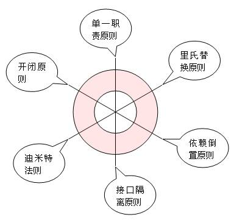

# 开闭原则(Open-Close Principle)
## 简介
Software entities (classes, modules, functions, etc.) should be open for extension but closed for modification.
软件实体（类，模块，方法等等）应当对扩展开放，对修改关闭，即软件实体应当在不修改的前提下扩展。

问题由来:在软件的生命周期内，因为变化、升级和维护等原因需要对软件原有代码进行修改时，可能会给旧代码中引入错误，也可能会使我们不得不对整个功能进行重构，并且需要原有代码经过重新测试。

解决方案: 开闭原则是面向对象设计中最基础的设计原则，它指导我们如何建立稳定灵活的系统。开闭原则可能是设计模式六项原则中定义最模糊的一个了，它只告诉我们对扩展开放，对修改关闭，可是到底如何才能做到对扩展开放，对修改关闭，并没有明确的告诉我们。以前，如果有人告诉我“你进行设计的时候一定要遵守开闭原则”，我会觉的他什么都没说，但貌似又什么都说了。因为开闭原则真的太虚了。

  在仔细思考以及仔细阅读很多设计模式的文章后，终于对开闭原则有了一点认识。其实，我们遵循设计模式其它5大原则，以及使用23种设计模式的目的就是遵循开闭原则。也就是说，只要我们对其它5项原则遵守的好了，设计出的软件自然是符合开闭原则的，这个开闭原则更像是前面五项原则遵守程度的“平均得分”，前面5项原则遵守的好，平均分自然就高，说明软件设计开闭原则遵守的好；如果前面5项原则遵守的不好，则说明开闭原则遵守的不好。
  
  开闭原则无非就是想表达这样一层意思：用抽象构建框架，用实现扩展细节。因为抽象灵活性好，适应性广，只要抽象的合理，可以基本保持软件架构的稳定。而软件中易变的细节，我们用从抽象派生的实现类来进行扩展，当软件需要发生变化时，我们只需要根据需求重新派生一个实现类来扩展就可以了。当然前提是我们的抽象要合理，要对需求的变更有前瞻性和预见性才行。


**其它的5项原则，恰恰是告诉我们用抽象构建框架，用实现扩展细节的注意事项而已：单一职责原则告诉我们实现类要职责单一；里氏替换原则告诉我们不要破坏继承体系；依赖倒置原则告诉我们要面向接口编程；接口隔离原则告诉我们在设计接口的时候要精简单一；迪米特法则告诉我们要降低耦合。而开闭原则是总纲，他告诉我们要对扩展开放，对修改关闭**。

最后说明一下如何去遵守这六个原则。对这六个原则的遵守并不是是和否的问题，而是多和少的问题，也就是说，我们一般不会说有没有遵守，而是说遵守程度的多少。任何事都是过犹不及，设计模式的六个设计原则也是一样，制定这六个原则的目的并不是要我们刻板的遵守他们，而需要根据实际情况灵活运用。对他们的遵守程度只要在一个合理的范围内，就算是良好的设计。我们用一幅图来说明一下。



图中的每一条维度各代表一项原则，我们依据对这项原则的遵守程度在维度上画一个点，则如果对这项原则遵守的合理的话，这个点应该落在红色的同心圆内部；如果遵守的差，点将会在小圆内部；如果过度遵守，点将会落在大圆外部。一个良好的设计体现在图中，应该是六个顶点都在同心圆中的六边形。

## 实例
在软件开发过程中，永远不变的就是变化。开闭原则是使我们的软件系统拥抱变化的核心原则之一。对扩展可放，对修改关闭给出了高层次的概括，即在需要对软件进行升级、变化时应该通过扩展的形式来实现，而非修改原有代码。当然这只是一种比较理想的状态，是通过扩展还是通过修改旧代码需要根据代码自身来定。

在Volley中，开闭原则体现得比较好的是Request类族的设计。我们知道，在开发C/S应用时，服务器返回的数据格式多种多样，有字符串类型、xml、json等。而解析服务器返回的Response的原始数据类型则是通过Request类来实现的，这样就使得Request类对于服务器返回的数据格式有良好的扩展性，即Request的可变性太大。

例如我们返回的数据格式是Json，那么我们使用JsonObjectRequest请求来获取数据，它会将结果转成JsonObject对象，我们看看JsonObjectRequest的核心实现。

```
/**
 * A request for retrieving a {@link JSONObject} response body at a given URL, allowing for an
 * optional {@link JSONObject} to be passed in as part of the request body.
 */
public class JsonObjectRequest extends JsonRequest<JSONObject> {
   // 代码省略
    @Override
    protected Response<JSONObject> parseNetworkResponse(NetworkResponse response) {
        try {
            String jsonString =
                new String(response.data, HttpHeaderParser.parseCharset(response.headers));
            return Response.success(new JSONObject(jsonString),
                    HttpHeaderParser.parseCacheHeaders(response));
        } catch (UnsupportedEncodingException e) {
            return Response.error(new ParseError(e));
        } catch (JSONException je) {
            return Response.error(new ParseError(je));
        }
    }
}
```	
	
JsonObjectRequest通过实现Request抽象类的parseNetworkResponse解析服务器返回的结果，这里将结果转换为JSONObject，并且封装到Response类中。

例如Volley添加对图片请求的支持，即ImageLoader( 已内置 )。这个时候我的请求返回的数据是Bitmap图片。因此我需要在该类型的Request得到的结果是Request，但支持一种数据格式不能通过修改源码的形式，这样可能会为旧代码引入错误。但是你又需要支持新的数据格式，此时我们的开闭原则就很重要了，对扩展开放，对修改关闭。我们看看Volley是如何做的。

```
/**
 * A canned request for getting an image at a given URL and calling
 * back with a decoded Bitmap.
 */
public class ImageRequest extends Request<Bitmap> {
	// 代码省略
	// 将结果解析成Bitmap，并且封装套Response对象中
    @Override
    protected Response<Bitmap> parseNetworkResponse(NetworkResponse response) {
        // Serialize all decode on a global lock to reduce concurrent heap usage.
        synchronized (sDecodeLock) {
            try {
                return doParse(response);
            } catch (OutOfMemoryError e) {
                VolleyLog.e("Caught OOM for %d byte image, url=%s", response.data.length, getUrl());
                return Response.error(new ParseError(e));
            }
        }
    }
    /**
     * The real guts of parseNetworkResponse. Broken out for readability.
     */
    private Response<Bitmap> doParse(NetworkResponse response) {
        byte[] data = response.data;
        BitmapFactory.Options decodeOptions = new BitmapFactory.Options();
        Bitmap bitmap = null;
        // 解析Bitmap的相关代码,在此省略
        if (bitmap == null) {
            return Response.error(new ParseError(response));
        } else {
            return Response.success(bitmap, HttpHeaderParser.parseCacheHeaders(response));
        }
    }
}
```
	
需要添加某种数据格式的Request时，只需要继承自Request类，并且实现相应的方法即可。这样通过扩展的形式来应对软件的变化或者说用户需求的多样性，即避免了破坏原有系统，又保证了软件系统的可扩展性。
