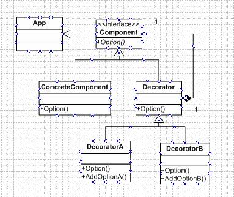

# 装饰原则(Decorator pattern)
## 简介
Decorator装饰模式是一种结构型模式，它主要是解决：“过度地使用了继承来扩展对象的功能”，由于继承为类型引入的静态特质，使得这种扩展方式缺乏灵活性；并且随着子类的增多（扩展功能的增多），各种子类的组合（扩展功能的组合）会导致更多子类的膨胀（多继承）。继承为类型引入的静态特质的意思是说以继承的方式使某一类型要获得功能是在编译时。所谓静态，是指在编译时；动态，是指在运行时。

修饰模式，是面向对象编程领域中，一种动态地往一个类中添加新的行为的设计模式。就功能而言，修饰模式相比生成子类更为灵活，这样可以给某个对象而不是整个类添加一些功能。

GoF《设计模式》中说道：动态的给一个对象添加一些额外的职责。就增加功能而言，Decorator模式比生成子类更为灵活。
下面来看看Decorator模式的结构：



看这个结构好像不是很明白，下面我根据代码讲解一下这个结构。我想了一个场景：我们现在用的手机功能很多，我就用Decorator模式实现一下对某个手机的GSP和蓝牙功能扩展。
首先，我们需要一个手机的接口或者是抽象类，我这里就用抽象类来实现，代码如下：

```
public abstract class AbstractCellPhone
    {
        public abstract string CallNumber();
        public abstract string SendMessage();
}
```

AbstractCellPhone也就是结构图中的Component，然后，我再来实现Nokia和Moto的手机类，这类要继承AbstractCellPhone，也就是图中ConcreteComponent类要继承Component，实现代码如下：

```
public class NokiaPhone : AbstractCellPhone
    {
        public override string CallNumber()
        {
            return "NokiaPhone call sombody";
        }
 
        public override string SendMessage()
        {
            return "NokiaPhone send a message to somebody";
        }
    }
 
    public class MotoPhone : AbstractCellPhone
    {
        public override string CallNumber()
        {
            return "MotoPhone call sombody";
        }
 
        public override string SendMessage()
        {
            return "MotoPhone send a message to somebody";
        }
 } 
```

接下来我需要一个Decorator接口或者抽象类，实现代码如下：

```
public abstract class Decorator:AbstractCellPhone
    {
        AbstractCellPhone _phone;
 
        public Decorator(AbstractCellPhone phone)
        {
            _phone = phone;
        }
 
        public override string CallNumber()
        {
            return _phone.CallNumber();
        }
 
        public override string SendMessage()
        {
            return _phone.SendMessage();
        }
  }
```
正如结构图中，这个Decorator即继承了AbstractCellPhone，又包含了一个私有的AbstractCellPhone的对象。这样做的意义是：Decorator类又使用了另外一个Component类。我们可以使用一个或多个Decorator对象来“装饰”一个Component对象，且装饰后的对象仍然是一个Component对象。在下来，我要实现GSP和蓝牙的功能扩展，它们要继承自Decorator，代码如下：

```
public class DecoratorGPS : Decorator
    {
        public DecoratorGPS(AbstractCellPhone phone)
            : base(phone)
        { }
 
        public override string CallNumber()
        {
            return base.CallNumber() + " with GPS";
        }
 
        public override string SendMessage()
        {
            return base.SendMessage() + " with GPS";
        }
    }
 
    public class DecoratorBlueTooth : Decorator
    {
        public DecoratorBlueTooth(AbstractCellPhone phone)
            : base(phone)
        { }
 
        public override string CallNumber()
        {
            return base.CallNumber() + " with BlueTooth";
        }
 
        public override string SendMessage()
        {
            return base.SendMessage() + " with BlueTooth";
        }
 }
```
最后，用客户端程序验证一下：

```
static void Main(string[] args)
        {
             AbstractCellPhone phone = new NokiaPhone();
            Console.WriteLine(phone.CallNumber());
            Console.WriteLine(phone.SendMessage());
            DecoratorGPS gps = new DecoratorGPS(phone);     //add GSP
            Console.WriteLine(gps.CallNumber());
            Console.WriteLine(gps.SendMessage());
            DecoratorBlueTooth bluetooth = new DecoratorBlueTooth(gps); //add GSP and bluetooth
            Console.WriteLine(bluetooth.CallNumber());
            Console.WriteLine(bluetooth.SendMessage());
            Console.Read();
     }
```

执行结果：
NokiaPhone call sombody
NokiaPhone send a message to somebody
NokiaPhone call sombody with GPS
NokiaPhone send a message to somebody with GPS
NokiaPhone call sombody with GPS with BlueTooth
NokiaPhone send a message to somebody with GPS with BlueTooth
 
从执行的结果不难看出扩展功能已被添加。最后再说说Decorator装饰模式的几点要点：

1. 通过采用组合、而非继承的手法，Decorator模式实现了在运行时动态的扩展对象功能的能力，而且可以根据需要扩展多个功能。避免了单独使用继承带来的“灵活性差”和“多子类衍生问题”。
2. Component类在Decorator模式中充当抽象接口的角色，不应该去实现具体的行为。而且Decorator类对于Component类应该透明——换言之Component类无需知道Decorator类，Decorator类是从外部来扩展Component类的功能。
3. Decorator类在接口上表现为is-a Component的继承关系，即Decorator类继承了Component类所具有的接口。但在实现上又表现为has-a Component的组合关系，即Decorator类又使用了另外一个Component类。我们可以使用一个或多个Decorator对象来“装饰”一个Component对象，且装饰后的对象仍然是一个Component对象。（在这里我想谈一下我的理解：当我们实例化一个Component对象后，要给这个对象扩展功能，这时我们把这个Component对象当作参数传给Decorator的子类的构造函数——也就是扩展方法的功能类。对于引用类型传参时，实际上只是传递对象的地址，这样，在功能扩展是，操作的应该是同一个对象）
4. Decorator模式并非解决“多子类衍生的多继承”问题，Decorator模式应用的要点在于解决“主体类在多个方向上的扩展功能”——是为“装饰”的含义。Decorator是在运行时对功能进行组合。

## 实例

### Category
Objective-C 中的 Category 就是对装饰模式的一种具体实现。它的主要作用是在不改变原有类的前提下，动态地给这个类添加一些方法。在 Objective-C 中的具体体现为：实例（类）方法、属性和协议。是的，在 Objective-C 中可以用 Category 来实现协议。本文将结合 runtime（我下载的是当前的最新版本 objc4-646.tar.gz) 的源码来探究它实现的原理。
### 使用场景
根据苹果官方文档对 Category 的描述，它的使用场景主要有三个：

 * 给现有的类添加方法.
 * 将一个类的实现拆分成多个独立的源文件.
 * 声明私有的方法.
 
 其中，第 1 个是最典型的使用场景，应用最广泛。

注：Category 有一个非常容易误用的场景，那就是用 Category 来覆写父类或主类的方法。虽然目前 Objective-C 是允许这么做的，但是这种使用场景是非常不推荐的。使用 Category 来覆写方法有很多缺点，比如不能覆写 Category 中的方法、无法调用主类中的原始实现等，且很容易造成无法预估的行为。

我们知道，无论我们有没有主动引入 Category 的头文件，Category 中的方法都会被添加进主类中。我们可以通过 - performSelector: 等方式对 Category 中的相应方法进行调用，之所以需要在调用的地方引入 Category 的头文件，只是为了“照顾”编译器同学的感受。

下面，我们将结合 runtime 的源码探究下 Category 的实现原理。打开 runtime 源码工程，在文件 objc-runtime-new.mm 中找到以下函数：

```
void _read_images(header_info **hList, uint32_t hCount)
{
    ...
        _free_internal(resolvedFutureClasses);
    }

    // Discover categories. 
    for (EACH_HEADER) {
        category_t **catlist =
            _getObjc2CategoryList(hi, &count);
        for (i = 0; i < count; i++) {
            category_t *cat = catlist[i];
            Class cls = remapClass(cat->cls);

            if (!cls) {
                // Category's target class is missing (probably weak-linked).
                // Disavow any knowledge of this category.
                catlist[i] = nil;
                if (PrintConnecting) {
                    _objc_inform("CLASS: IGNORING category \?\?\?(%s) %p with "
                                 "missing weak-linked target class",
                                 cat->name, cat);
                }
                continue;
            }
            
			  ***	
            // Process this category. 
            // First, register the category with its target class. 
            // Then, rebuild the class's method lists (etc) if 
            // the class is realized. 
            BOOL classExists = NO;
            if (cat->instanceMethods ||  cat->protocols
                ||  cat->instanceProperties)
            {
                addUnattachedCategoryForClass(cat, cls, hi);
                if (cls->isRealized()) {
                    remethodizeClass(cls);
                    classExists = YES;
                }
                if (PrintConnecting) {
                    _objc_inform("CLASS: found category -%s(%s) %s",
                                 cls->nameForLogging(), cat->name,
                                 classExists ? "on existing class" : "");
                }
            }

            if (cat->classMethods  ||  cat->protocols
                /* ||  cat->classProperties */)
            {
                addUnattachedCategoryForClass(cat, cls->ISA(), hi);
                if (cls->ISA()->isRealized()) {
                    remethodizeClass(cls->ISA());
                }
                if (PrintConnecting) {
                    _objc_inform("CLASS: found category +%s(%s)",
                                 cls->nameForLogging(), cat->name);
                }
            }
        }
    }

    // Category discovery MUST BE LAST to avoid potential races 
    // when other threads call the new category code before 
    // this thread finishes its fixups.

    // +load handled by prepare_load_methods()

    ...
}
```

从第 27-58 行的关键代码，我们可以知道在这个函数中对 Category 做了如下处理：

* 将 Category 和它的主类（或元类）注册到哈希表中；
* 如果主类（或元类）已实现，那么重建它的方法列表。
在这里分了两种情况进行处理：Category 中的实例方法和属性被整合到主类中；而类方法则被整合到元类中（关于对象、类和元类的更多细节，可以参考博文[Objective-C 对象模型](http://blog.leichunfeng.com/blog/2015/04/25/objective-c-object-model/)。另外，对协议的处理比较特殊，Category 中的协议被同时整合到了主类和元类中。

我们注意到，不管是哪种情况，最终都是通过调用 static void remethodizeClass(Class cls) 函数来重新整理类的数据的。

```
static void remethodizeClass(Class cls)
{
    ...
                         cls->nameForLogging(), isMeta ? "(meta)" : "");
        }

        // Update methods, properties, protocols

        attachCategoryMethods(cls, cats, YES);

        newproperties = buildPropertyList(nil, cats, isMeta);
        if (newproperties) {
            newproperties->next = cls->data()->properties;
            cls->data()->properties = newproperties;
        }

        newprotos = buildProtocolList(cats, nil, cls->data()->protocols);
        if (cls->data()->protocols  &&  cls->data()->protocols != newprotos) {
            _free_internal(cls->data()->protocols);
        }
        cls->data()->protocols = newprotos;

        _free_internal(cats);
    }
}
```
这个函数的主要作用是将 Category 中的方法、属性和协议整合到类（主类或元类）中，更新类的数据字段 ```data()``` 中 ```method_lists```（或 ```method_list```）、```properties``` 和 `protocols` 的值。进一步，我们通过 `attachCategoryMethods` 函数的源码可以找到真正处理 Category 方法的 `attachMethodLists` 函数：

```
static void
attachMethodLists(Class cls, method_list_t **addedLists, int addedCount,
                  bool baseMethods, bool methodsFromBundle,
                  bool flushCaches)
{
    ...
        newLists[newCount++] = mlist;
    }

    // Copy old methods to the method list array
    for (i = 0; i < oldCount; i++) {
        newLists[newCount++] = oldLists[i];
    }
    if (oldLists  &&  oldLists != oldBuf) free(oldLists);

    // nil-terminate
    newLists[newCount] = nil;

    if (newCount > 1) {
        assert(newLists != newBuf);
        cls->data()->method_lists = newLists;
        cls->setInfo(RW_METHOD_ARRAY);
    } else {
        assert(newLists == newBuf);
        cls->data()->method_list = newLists[0];
        assert(!(cls->data()->flags & RW_METHOD_ARRAY));
    }
}
``` 

这个函数的代码量看上去比较多，但是我们并不难理解它的目的。它的主要作用就是将类中的旧有方法和 Category 中新添加的方法整合成一个新的方法列表，并赋值给 method_lists 或 method_list 。通过探究这个处理过程，我们也印证了一个结论，那就是主类中的方法和 Category 中的方法在 runtime 看来并没有区别，它们是被同等对待的，都保存在主类的方法列表中。

不过，类的方法列表字段有一点特殊，它的结构是联合体，method_lists 和 method_list 共用同一块内存地址。当 newCount 的个数大于 1 时，使用 method_lists 来保存 newLists ，并将方法列表的标志位置为 RW_METHOD_ARRAY ，此时类的方法列表字段是 method_list_t 类型的指针数组；否则，使用 method_list 来保存 newLists ，并将方法列表的标志位置空，此时类的方法列表字段是 method_list_t 类型的指针。

```
// class's method list is an array of method lists
#define RW_METHOD_ARRAY       (1<<20)

union {
    method_list_t **method_lists;  // RW_METHOD_ARRAY == 1
    method_list_t *method_list;    // RW_METHOD_ARRAY == 0
};
```

我们注意到 runtime 对 Category 中方法的处理过程并没有对 +load 方法进行什么特殊地处理。因此，严格意义上讲 Category 中的 +load 方法跟普通方法一样也会对主类中的 +load 方法造成覆盖，只不过 runtime 在自动调用主类和 Category 中的 +load 方法时是直接使用各自方法的指针进行调用的。所以才会使我们觉得主类和 Category 中的 +load 方法好像互不影响一样。因此，当我们手动给主类发送 +load 消息时，调用的一直会是分类中的 +load 方法，you should give it a try yourself 。


